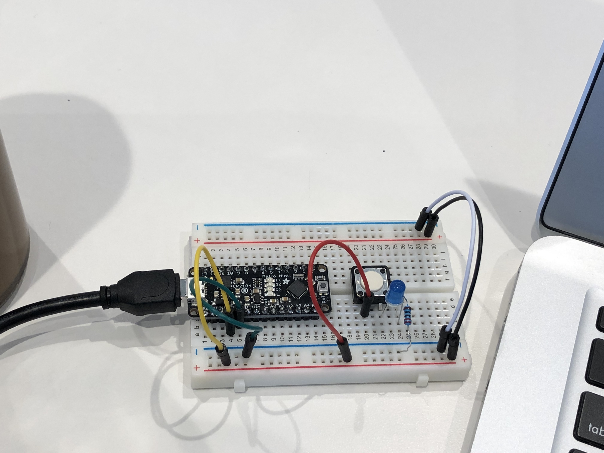

# Lab1: Light it up!

**A lab report by Dan Witte**


## Part A. Set Up a Breadboard




## Part B. Manually Blink a LED

**a. What color stripes are on a 100 Ohm resistor?**<br/>
The resistor body is blue, with stripes: red, red, black, black, red.
 
**b. What do you have to do to light your LED?** <br/>
In order to light the LED I have to click the button down, closing the circuit and allowing the current to flow.


## Part C. Blink a LED using Arduino

### 1. Blink the on-board LED

**a. What line(s) of code do you need to change to make the LED blink (like, at all)?**
```
pinMode(LED_BUILTIN, OUTPUT);
    digitalWrite(LED_BUILTIN, HIGH);
```

**b. What line(s) of code do you need to change to change the rate of blinking?**
```
delay(1000);                      
digitalWrite(LED_BUILTIN, LOW);
delay(1000);
```
Changing the delays will change the amount of time between each blink.

**c. What circuit element would you want to add to protect the board and external LED?**<br/>
A resistor to reduce the current reaching the LED.
 
**d. At what delay can you no longer *perceive* the LED blinking? How can you prove to yourself that it is, in fact, still blinking?**<br/>
Around 5ms. You could test the voltage using a multimeter. Using a multi-meter you might find that the voltage is fluctuating much more than expected.

**e. Modify the code to make your LED blink your way. Save your new blink code to your lab 1 repository, with a link on the README.md.**<br/>
[Custom blink](./CustomBlink.ino)

### 2. Blink your LED

**Make a video of your LED blinking, and add it to your lab submission.**
[Blinking LED](https://photos.app.goo.gl/5yYHmXPSZyMVVevK7)


## Part D. Manually fade an LED

**a. Are you able to get the LED to glow the whole turning range of the potentiometer? Why or why not?**<br/>
Yes, the pot resistance is not so high that there is not enough voltage to light up the led. Generally as the pot resistance is turned up the light dims, and as the post resistance is turned down the light brightens.


## Part E. Fade an LED using Arduino

**a. What do you have to modify to make the code control the circuit you've built on your breadboard?**<br/>
Change LED var to 11.

**b. What is analogWrite()? How is that different than digitalWrite()?**<br/>
analogwrite is on a scale of 0-255 whereas digitalwrite is binary, either on or off. This allows analogwrite to effectively supply varying voltage.

## Part F. FRANKENLIGHT!!!

### 1. Take apart your electronic device, and draw a schematic of what is inside. 


**a. Is there computation in your device? Where is it? What do you think is happening inside the "computer?"**<br/>
Yes, there is a processor in the center of the board. Given that this is a web camera, it is likely manipulating the camera to adjust for lighting, focus, etc. and possibly manipulating the signal from the before sending it to the computer.

**b. Are there sensors on your device? How do they work? How is the sensed information conveyed to other portions of the device?** <br/>
There are 2 sensors (including a mic). One is an image sensor, which takes in light and converts it to a digital signal made up of pixels that stores light and color. The mic takes in acoustic waves and converts them to a digital signal. These 2 signals are then sent to the computer hooked up to the webcam, there is likely no combining the signals on the webcam itself.

**c. How is the device powered? Is there any transformation or regulation of the power? How is that done? What voltages are used throughout the system?**<br/>
The device is powered by hooking up to usb. According to the USB cable, the device does not say its voltage but it is likely 3.3V or 5V. There is a capacitor present, which would be used to regulate power to components. 

**d. Is information stored in your device? Where? How?** <br/>
There is no information stored on the device, it has no memory.

### 2. Using your schematic, figure out where a good point would be to hijack your device and implant an LED. <br/>
The mic is connected to the board by wires that have clear anode and cathode connectors. I removed the glue covering these and connected my light directly to the anode and cathode and it lit up. Given the relatively low voltage going to the mic, no resistors we're needed to regulate the voltage.

### 3. Build your light!

**Make a video showing off your Frankenlight.**<br/>
[FrankenLight Video](./IMG_0732.TRIM.MOV)

**Include any schematics or photos in your lab write-up.**
